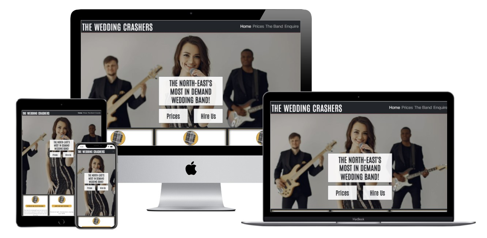
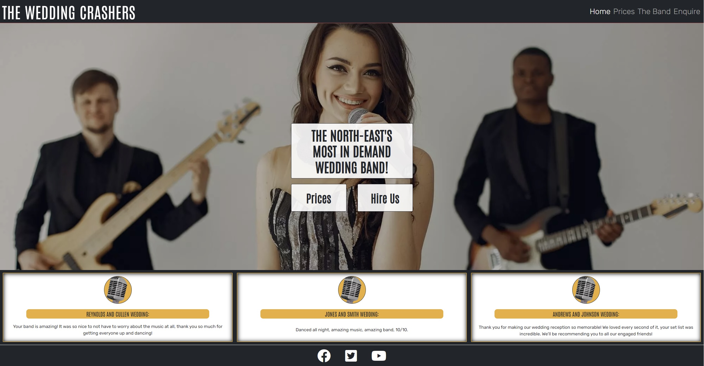
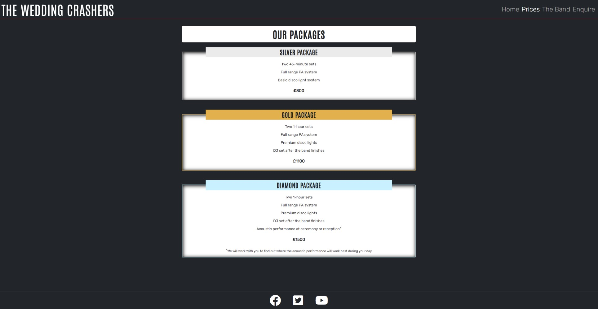
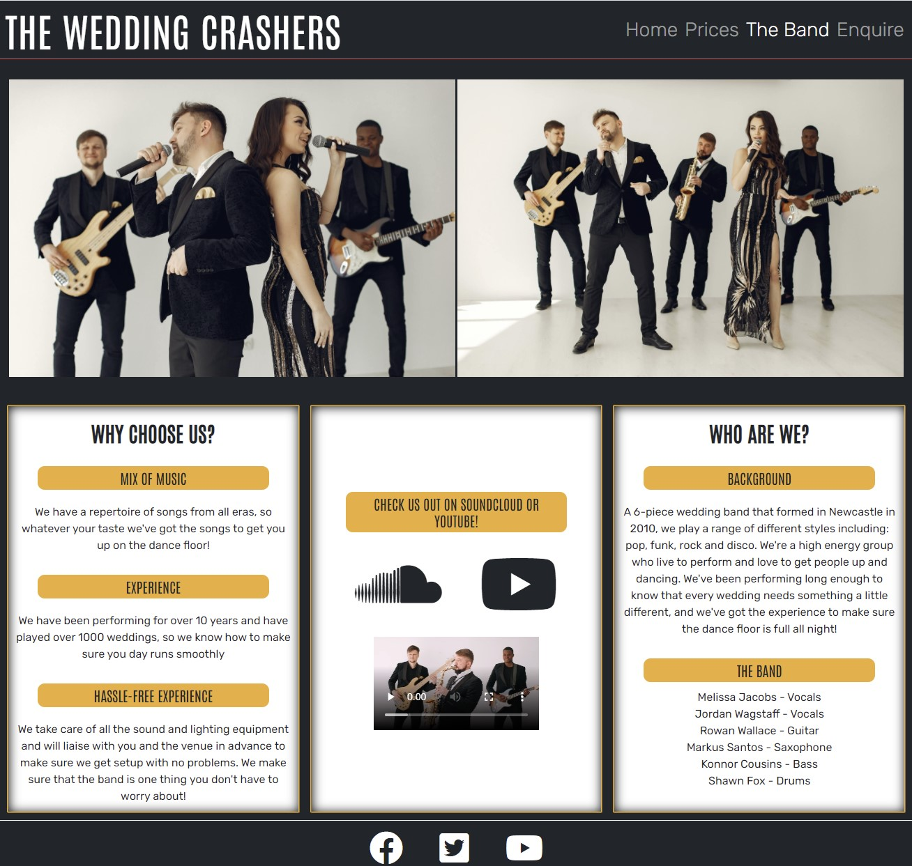
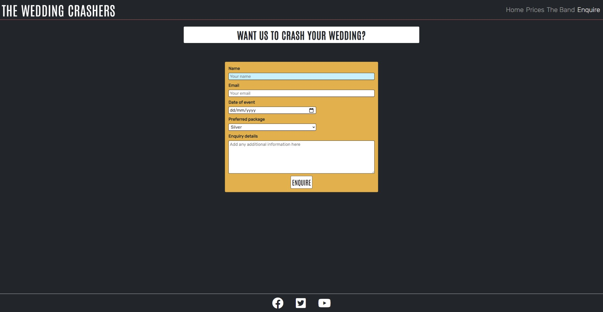
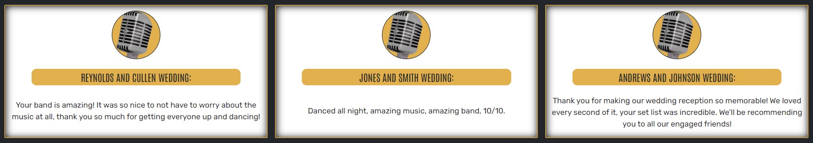
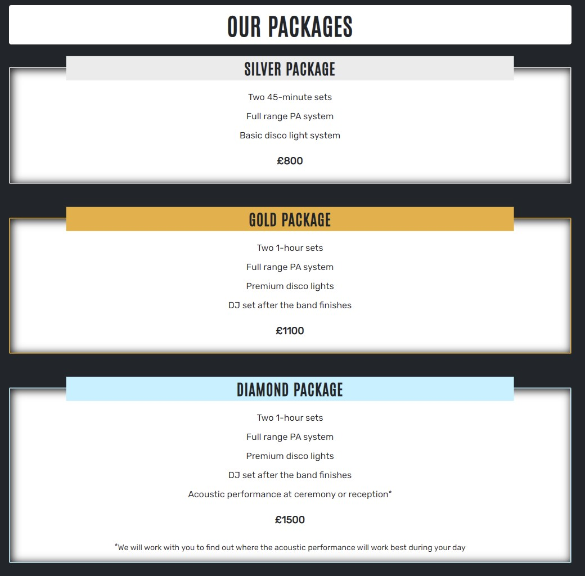
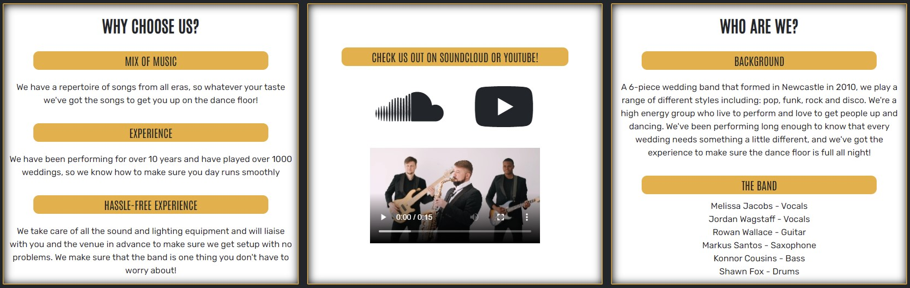

# The Wedding Crashers

Welcome to The Wedding Crashers website! This site is aimed at people looking for a live band for their wedding day. The site allows users to learn more about the band, see what packages they offer and how much they cost, and contact the band directly to initiate a booking. In addition to providing information, the site is also an advertisement for the band, enabling users to see what the band look like as an ensemble as well as providing links to (hypothetical) social media accounts where band recordings can be listened to.

_[Note that The Wedding Crashers is a fictional band, created for the purposes of the Code Institute Portfolio Project]_

## Live Site

The live site can be found [here](https://adamhatton.github.io/pp1-wedding-band/).

Screenshots of each page can be seen below:

**Home page**

**Prices page**

**The Band page**

**Enquire Page**

## Features

In this section I will describe each of the features of the website in general. I explore the value of these and how they meet the needs of the user stories in the <TESTING SECTION>.

### Existing Features

**Navigation Bar**

- The navigation bar is included on all 4 pages and contains the logo (which acts as link to the homepage) and links to all pages: Home, Prices, The Band, Enquire.
- The navbar was implemented using Bootstrap 5 so is responsive across different screen sizes, and will collapse into a burger menu when there is not enough space for all elements.
- The navbar is fixed to the top of the page so can always be seen, even when scrolling on smaller screens.

**Landing Page (Hero Image, Text Overlay and Buttons)**

- The landing page contains a large photograph centred on the vocalist of the band. It is overlaid with some text which explains who “The Wedding Crashers” are.
- The landing page also includes two call to action buttons: one for seeing the band prices, and one for contacting the band. Both of these buttons change colour when hovered over, providing feedback to the user that they are interactive.

**Testimonial Cards**

- Below the landing page image are three cards containing testimonials from people who have previously hired The Wedding Crashers.
- Each card contains an image of a microphone styled into a circle, a heading to highlight the people that made the comment, and a quote of what they had to say about the band.
- The cards were implemented with Bootstrap 5 so are responsive across different devices.

**Footer**

- The footer contains 3 links to different social media sites: Facebook, Twitter, and Youtube.
- The links change colour when hovered over to provide feedback that they are interactive, and when clicked they open in a new tab.

**Prices Page**

- The prices page contains a heading to highlight the purpose of the page, and 3 cards which contain information on the different packages the band offers.
- The cards are styled in the same colour as the name of the package to visually reinforce the difference in the contents. The price has a larger font size and is in bold to help it stand out as the key piece of information. 
- The cards were implemented with Bootstrap 5 so are responsive across different devices.

**The Band Page**

_Band Images_

- On the page ‘The Band’, there is a single image of the band for smaller screen sizes, and two images for larger screen sizes. The images allow the user to see what the band looks like when performing.

_Band Information_

- Below the band images are three cards containing more information about the band.
- Card 1 contains more information about the bands experience, an advertisement for why they are a good choice to hire.
- Card 2 contains links to the band’s (hypothetical) Soundcloud and YouTube pages so that the user can navigate to other platforms to hear what the band sound like. This card also contains a video of the band; the video does not auto-play but the user can choose to play it in order to see a clip of some of the band members in action.
- Card 3 contains some background information about how the band formed and who the band members are.
- The cards were implemented with Bootstrap 5 so are responsive across different devices.

**Enquire Page**

- The ‘Enquire’ page contains a heading to highlight the purpose of the page and a contact form. The contact form will allow the user to send an enquiry to the band which includes their name, email address, the date of their events, the package they are interested in and any additional information.

_[Note that the contact form does not currently function as it is written only in html and css, it cannot send any data]_

**General**

- The website was designed with a mobile-first approach and has been written to be responsive on all device types.

### Future Features

- Availability Checker: It would be useful for users to be able to check band availability so that they can see in advance whether the band are free rather than needing to submit a contact form.
