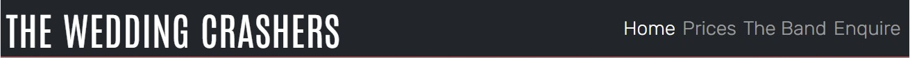
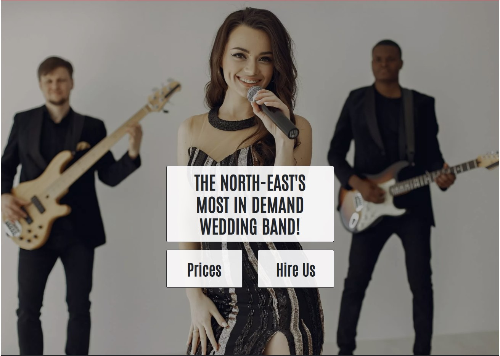
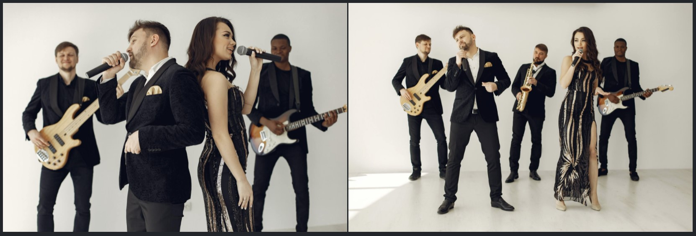

# The Wedding Crashers

Welcome to The Wedding Crashers website! This site is aimed at people looking for a live band for their wedding day. The two main goals of the site are:

1. To allow users to learn more about the band, see what packages they offer and how much they cost, and contact the band directly to initiate a booking.
2. To act as an advertisement for the band, enabling users to see what the band look like as an ensemble as well as providing links to (hypothetical) social media accounts where band recordings can be listened to.

_[Note that The Wedding Crashers is a fictional band, created for the purposes of the Code Institute Portfolio Project]_

## Live Site

The live site can be found [here](https://adamhatton.github.io/pp1-wedding-band/).

Screenshots of each page can be seen below:

Home page

Prices page

The Band page

Enquire page

## Features

In this section I will describe each of the features of the website in general. I explore the value of these and how they meet the needs of the user stories in the [testing section](<#testing>).

### Existing Features

#### Navigation Bar

- The navigation bar is included on all 4 pages and contains the logo (which acts as link to the homepage) and links to all pages: Home, Prices, The Band, Enquire.
- The navbar was implemented using Bootstrap 5 so is responsive across different screen sizes, and will collapse into a burger menu when there is not enough space for all elements.
- The navbar is fixed to the top of the page so can always be seen, even when scrolling on smaller screens.

#### Landing Page

- The landing page contains a large photograph centred on the vocalist of the band. It is overlaid with some text which explains who “The Wedding Crashers” are.
- The landing page also includes two call to action buttons: one for seeing the band prices, and one for contacting the band. Both of these buttons change colour when hovered over, providing feedback to the user that they are interactive.

#### Testimonial Cards

- Below the landing page image are three cards containing testimonials from people who have previously hired The Wedding Crashers.
- Each card contains an image of a microphone styled into a circle, a heading to highlight the people that made the comment, and a quote of what they had to say about the band.
- The cards were implemented with Bootstrap 5 so are responsive across different devices.

#### Footer

- The footer contains 3 links to different social media sites: Facebook, Twitter, and YouTube.
- The links change colour when hovered over to provide feedback that they are interactive, and when clicked they open in a new tab.

#### Prices Page

- The prices page contains a heading to highlight the purpose of the page, and 3 cards which contain information on the different packages the band offers.
- The cards are styled in the same colour as the name of the package to visually reinforce the difference in the contents. The price has a larger font size and is in bold to help it stand out as the key piece of information. 
- The cards were implemented with Bootstrap 5 so are responsive across different devices.

#### The Band Page

_Band Images_

- On the page ‘The Band’, there is a single image of the band for smaller screen sizes, and two images for larger screen sizes. The images allow the user to see what the band looks like when performing.

_Band Information_

- Below the band images are three cards containing more information about the band.
- Card 1 contains more information about the bands experience, an advertisement for why they are a good choice to hire.
- Card 2 contains links to the band’s (hypothetical) Soundcloud and YouTube pages so that the user can navigate to other platforms to hear what the band sound like. This card also contains a video of the band; the video does not auto-play but the user can choose to play it in order to see a clip of some of the band members in action.
- Card 3 contains some background information about how the band formed and who the band members are.
- The cards were implemented with Bootstrap 5 so are responsive across different devices.

#### Enquire Page

- The ‘Enquire’ page contains a heading to highlight the purpose of the page and a contact form. The contact form will allow the user to send an enquiry to the band which includes their name, email address, the date of their events, the package they are interested in and any additional information.

_[Note that the contact form does not currently function as it is written only in HTML and CSS, it cannot send any data]_

#### General

- The website was designed with a mobile-first approach and has been written to be responsive on all device types.

### Future Features

- Availability Checker: It would be useful for users to be able to check band availability so that they can see in advance whether the band are free rather than needing to submit a contact form.

## User Experience

### User Stories

The target audience of the website is people who are looking to book a band for a wedding (or other event), so the site has been designed on the basis of the following user stories:

**First Time Visitor**
- As a first time visitor, I want to easily understand what the site is about
- As a first time visitor, I want to be able to easily navigate around the site
- As a first time visitor, I want the website to be responsive to different devices 
- As a first time visitor, I want to easily be able to find out more about the band
- As a first time visitor, I want to easily be able to find out how much the band costs to hire
- As a first time visitor, I want to be able to contact the band to initiate a booking
- As a first time visitor, I want to know what the band sounds like

**Returning Visitor**
- As a returning visitor, I want to easily be able to access the contact page

### Design

#### Colours

The below colours have been used throughout the website:

An initial palette was created by uploading a picture of the band into the [Colormind Smart Image tool](http://colormind.io/image/), this palette was then further refined to the one seen above.
- #212529 (Charleston Green) and #fff (White) are used for a simplistic and sleek feel, but one that also feels professional.
- #EFAD43 (Marigold) was used to match the band aesthetic, but the use of gold also provides a sense of a premium service.
- #B9F2FF (Blizzard Blue) and #EBEBEB (Platinum) were used to highlight the packages to match their titles, as well as to provide areas of contrast within the website.
- #DB5461 has been used in a single place: the bottom border of the header. This provides a clean break between the header and the page content without causing confusion with other colours on the page.

#### Typography

The logo and headings use the font Antonio with a fall-back of sans-serif. Antonio was chosen as it has a professional yet strong character to it and it punctuates key points of the page well.
All other text uses the font Rubik, with a fall back of sans-serif. Rubik was chosen as it is easily readable but maintains a professional yet friendly quality.
Both fonts were imported from [Google Fonts](https://fonts.google.com/).

#### Imagery

As the website is an advertisement of the band, the imagery used is of the band itself. Large, high quality images have been used in order to showcase the band in a pseudo-performance, providing an energetic quality.

#### Wireframes

Home Page

Prices Page

The Band Page

Enquire Page

Minor changes were made to the wireframes during development to improve the overall aesthetic and flow of information. The most notable of these was to change the Price page cards to be vertically stacked instead of horizontal, this was done to avoid an excessive amount of negative space making the cards appear too separated.

## Technologies

### Development Technologies

**Languages**
- [HTML5](https://en.wikipedia.org/wiki/HTML5) - used to write the structure of the site
- [CSS](https://en.wikipedia.org/wiki/CSS) - used for the styling of the site

**Frameworks, Libraries and Tools**
- [Bootstrap 5.0](https://getbootstrap.com/docs/5.0/getting-started/introduction/) - used for the navbar and the cards (cards appear on all pages except the ‘Enquire’ page)
- [Google Fonts](https://fonts.google.com/) - used to import both Antonio and Rubik which are the fonts used throughout the entire site
- [Font Awesome](https://fontawesome.com/) - used to add icons for links to different social media sites
- [Gitpod](https://www.gitpod.io/) - used to write and develop the website
- [Git](https://git-scm.com/) – used for version controlling by using the Gitpod terminal to commit to Git, and subsequently pushing to GitHub
- [GitHub](https://github.com/) – used to store the source code for the website
- [GitHub pages](https://pages.github.com/) – used to deploy the live site
- [Balsamiq](https://balsamiq.com/) - used to create the initial wireframes of the website
- [Chrome DevTools](https://developer.chrome.com/docs/devtools/) - used throughout the process for testing the responsiveness of the website, debugging issues, and experimenting with layout/style choices
- [Cloudconvert](https://cloudconvert.com/) - used to convert the biggest images to .webp format
- [TinyPNG](https://tinypng.com/) - used to reduce the size of other image files
- [Techsini](http://techsini.com/multi-mockup/) - used to generate a multi-device mockup (as seen at the beginning of the README)
- [Name-generator](https://www.name-generator.org.uk/quick/) -  used to create names for the band members
- [Hex2RGBA](http://hex2rgba.devoth.com/) - used for converting Hex codes to rgba format

### Testing Technologies

- [a11y Contrast Checker](https://color.a11y.com/) - used for checking contrast accessibility
- [Jigsaw CSS validator](https://jigsaw.w3.org/css-validator/) - used for validating the CSS stylesheet
- [W3C HTML validator](https://validator.w3.org/) - used for validating the HTML markup
- [Lighthouse](https://developers.google.com/web/tools/lighthouse) - used for analysing the performance, accessibility, best practices and SEO of the website

## Testing

### User Stories

#### First time visitor

**As a first time visitor, I want to easily understand what the site is about**
-	On the landing page the user is presented with a large image of people holding instruments with the text “THE NORTH-EAST'S MOST IN DEMAND WEDDING BAND!” overlaid. This makes it immediately clear that the site is to showcase The Wedding Crashers as a band ([see landing page](<#landing-page>))
-	The user is also greeted with two call to action buttons: one for checking prices, and one titled ‘Hire Us’, inviting the user to get in touch with the band. The buttons make it clear that the site can provide further information about the bands services ([see landing page](<#landing-page>))

**As a first time visitor, I want to be able to easily navigate around the site**
-	The user is presented with an easily readable navbar throughout the site. This contains links to all of the pages within the website, and is always visible to the user so they will always feel like they have somewhere they can go. In addition, the Logo also serves as a link to the home page in line with conventional website behaviour ([see navbar](#navigation-bar))
-	On smaller screens, the navbar collapses into a hamburger menu allowing the user easy access to the page links whenever they need them ([see navbar](#navigation-bar))
-	The landing page provides prominent buttons for taking the user to key sections of the website: prices and enquiries. ([see landing page](<#landing-page>))

**As a first time visitor, I want the website to be responsive to different devices**
-	All elements of the website have been designed to be responsive across devices
-	The navbar grows and shrinks with the size of the device, and will collapse to a hamburger menu when the screen drops below a certain size ([see navbar](#navigation-bar))
-	Font sizes will change depending on the screen size. Tablet sized devices have a font size increase of roughly 50%, and larger screens have a 100% size increase for important elements such as headings and the navbar.
-	Bootstrap was used to implement cards, meaning that they will stack on top of each other on smaller screen sizes (see the below screenshot):

Stacking cards

-	‘The Band’ page is set to only show 1 image on smaller screen sizes so as not to overcrowd the information. On larger screens, another image is added to fill the space (see below screenshots):

Responsive images

**As a first time visitor, I want to easily be able to find out more about the band**
-	The navbar contains a link to “The Band” page which is accessible from anywhere on the site. Users can use this to navigate to this page which contains more information
-	“The Band” page has two cards dedicated to providing further information about the band, and a third card which takes users to the band’s social media accounts [note that these do not exist] ([see the band page](<#the-band-page>))
-	The home page also contains testimonial cards which let the user to see what people who have hired the band had to say about them, helping them to learn more about the service that is offered. ([see testimonial cards](<#testimonial-cards>))
-   The footer contains links which will take users to the band’s social media accounts to be able to find out more information [note that these do not exist] ([see footer](<#footer>))

**As a first time visitor, I want to easily be able to find out how much the band costs to hire**
-	Upon entering the site the user is immediately met with a call to action button for viewing prices ([see landing page](<#landing-page>))
-	The prices page is also linked to in the navbar which is always in view and accessible anywhere on the website
-	The “Prices” page clearly lays out the different packages the band offers, and has a boldened price associated with each ([see prices page](<#prices-page>))

**As a first time visitor, I want to be able to contact the band to initiate a booking**
-	Upon entering the site the user is immediately met with a call to action button for contacting the band ([see landing page](<#landing-page>))
-	The “Enquire” page is also linked to in the navbar which is always in view and accessible anywhere on the website
-	The “Enquire” page provides a contact form for getting in touch with the band. This is for demonstration purposes and does not actually send any data. ([see enquire page](<#enquire-page>))

**As a first time visitor, I want to know what the band sounds like**
-	On “The Band” page, the user is able to click links to the band’s social media accounts where they are able to hear what the band sounds like [note that these accounts do not exist]

#### Returning Visitor

**As a returning visitor, I want to easily be able to access the contact page**
-	The same points that apply to the first time visitor user story about contacting the band also apply here

### Validation and Manual Testing

The steps taken for validation and manual testing have been summarised below, but a document with full details and screenshots can be found [here](docs/testing/testing-info.md).

- Each page of the website was run through the [W3C HTML validator](https://validator.w3.org/). Initially one error was found, but this was fixed ([see bugs section](<#bugs>)). After rerunning the pages through, no errors were found.
- The website was run through the [Jigsaw CSS validator](https://jigsaw.w3.org/css-validator/) and no errors were found
- Each page of the website was run through the [a11y Contrast Checker](https://color.a11y.com/) and no errors were found
- Each page of the website was run through [Lighthouse](https://developers.google.com/web/tools/lighthouse) to analyse the performance, accessibility, best practices and SEO of the site. All results were 90+ (apart from the performance of the mobile version of the home page which returned 89. All measures to reduce the file sizes on this page had been taken so I decided to leave it due to it being so close to 90)

The following checks were made on a desktop using 3 separate browsers: Chrome, Edge and Firefox. The checks were also replicated on a Samsung Galaxy s21 (apart from checking hover over effects, and responsive breakpoints):
- Internal links on each page were manually checked to ensure they were not broken and went to the correct page.
- External links on each page were manually checked to ensure they were not broken, went to the correct page, and opened in a new tab.
- Hover over effects for all relevant elements were checked on each page to ensure they were working
- Responsive design was checked on each page to ensure that the relevant breakpoints were being hit
- The video on "The Band" page was tested to ensure it was not auto-playing and to ensure the controls worked
- The form on the "Enquire" page was tested to ensure each field displayed the focus styling when selected, and accepted input
- The form was also tested to ensure the submit button would not work until all required fields were populated

An excel document containing the test data can be seen in the separate [testing file](docs/testing/testing-info.md) (as linked above).

## Bugs

**HTML Validation Error**

After running the homepage through the W3C validator, it returned an error that button elements must not appear as descendants of anchor elements. The original code looks as follows:
~~~

        <a href="prices.html">
                <button class="homepage-button" id="prices-btn">Prices</button>
        </a>
        <a href="enquire.html">
                <button class="homepage-button" id="hire-btn">Hire Us</button>
        </a>

~~~
To resolve this, I removed the button elements and transferred the styling classes over to the anchor elements. I needed to add some additional styling to the text within the anchor elements to mimic button text, specifically using margins to centre the text horizontally and line-height to centre it vertically. I also had to remove the default text-decoration and :hover text effect associated with anchor elements. Following the fix, the html code looks as follows:
~~~

        <a href="prices.html" class="homepage-button" id="prices-btn">Prices</a>
        <a href="enquire.html" class="homepage-button" id="hire-btn">Hire Us</a>

~~~

**:focus Background Bug**

During testing I found a bug stemming from a style applied to the :focus pseudo-class. Originally I had applied the style to the pseudo-class directly with the intent of having fields in the contact form have a blue background when focused, as below:
~~~
:focus {
    outline: none;
    background-color:rgba(185, 242, 255, 1);
}
~~~
This caused all other elements to produce a blue artefact once selected, as below:

To fix this, I changed the specificity of the CSS rule to only apply to classes that are descendants of the form, as below:
~~~
.text-input:focus,
.date-input:focus,
.select-input:focus {
    outline: none;
    background-color:rgba(185, 242, 255, 1);
}
~~~

## Deployment

To deploy the live site, the following steps were taken:

1. Go to github.com
2. Login to my GitHub account
3. Select the relevant repository from my repository list:

4. Go to the settings within the repository:

5. From within settings, select ‘Pages’ from the menu:

6. Select the ‘main’ branch from the ‘Source’ dropdown menu:

7. Select 'Save'
8. After a short while, the site is published and confirmation is provided:

## Credits/Resources

### Code

- The [Bootstrap 5.0](https://getbootstrap.com/docs/5.0/getting-started/introduction/) framework has been used on the site for a responsive navbar and responsive cards
- To gain a better understanding of Bootstrap and specifically the navbar framework, I used [this YouTube tutorial](https://www.youtube.com/watch?v=akXfF066MY0) by "A Designer Who Codes"
- The method of applying a box-shadow to the hero-image was taken from the comments of [this Stack Overflow post](https://stackoverflow.com/questions/9182978/semi-transparent-color-layer-over-background-image?noredirect=1&lq=1) (specifically from user 'Neurotransmitter)
- To gain a better understanding of centering content on Bootstrap cards, I sued [this Stack Overflow post](https://stackoverflow.com/questions/46857136/bootstrap-4-vertical-align-text-wont-center-on-card). Whilst I did not copy any code directly, the concepts I learned from the page were used in my code

### Content

- All content other than the band member names was written by Adam Hatton (the developer)
- The band member names were generated using [Name-generator](https://www.name-generator.org.uk/quick/)

### Media

- Pictures of the band were taken from [Pexels](https://www.pexels.com/), specifically from user Gustavo Fring's content. Specific URLs have been included within the HTML and CSS code where the files are used
- The video on "The Band" page was also taken from Gustavo Fring's content on [Pexels](https://www.pexels.com/). A specific URL is provided in the code.
- The image of a vintage microphone on the homepage was taken from [Pixabay](https://pixabay.com/). A specific URL is provided in the code.

### Acknowledgements

- I'd like to thank my mentor Spencer Barriball for his guidance in the planning stage of the project and feedback on the finished product.
- I'd also like to thank my Partner Nichola for her constant support, feedback on what I was creating, and tolerance for putting up with me constantly talking about it!
