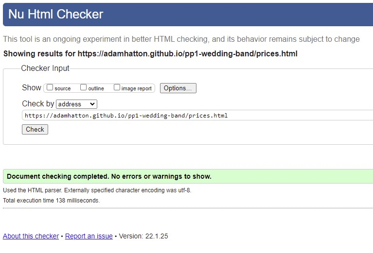

# Testing for The Wedding Crashers

## W3C Validation

I passed each page of the website through the W3C validator. After the first pass the below error was highlighted:

Button Error

I fixed this by removing the buttons from the anchor tabs and restyling the anchor tabs to appear as buttons. The only other issue following the first pass was a warning that a section on "The Band" page did not have a heading, as it only contained images. After consideration I changed this to be a div instead as I didn't believe the images to be a section semantically.

After fixing these issues I passed the pages through a second time and there were no issues. After my final session with my mentor I added a favicon to my site along with a link to it in my HTML head. I passed each page through the W3C validator again and there were no issues as shown in the below screenshots:

Home page

Prices page

The Band page

Enquire page

## Jigsaw Validation

I passed the website through the Jigsaw validator and this returned no errors:

## A11Y Contrast Checker

I passed each page of the website through the a11y contrast checker and no errors were found:

Home page

Prices page

The Band page

Enquire page

## Lighthouse Analysis

I passed each page through the Lighthouse tool produce a report for both desktop and mobile performance. All results were 90+ except for the homepage performance on mobile which was 89. As I had already reduced the file sizes of the images as much as possible I decided to leave this due to it being so close to 90. The results are below:

Home page

Prices page

The Band page

Enquire page

## Manual Testing

I performed manual testing on all of the pages to ensure the following:

- All internal links work and go to the correct page
- All external links work, go to the correct page, and open in a new tab
- The styles on :hover pseudo-classes work
- The video on "The Band" page operates as intended (i.e. no auto-play, controls work)
- The styles on the contact form :focus pseudo-class work
- The contact form fields accept input
- The submit button does not work unless all required fields are populated
- Responsive elements are activated at the relevant breakpoints

These tests were completed on 3 different browsers on a desktop: Chrome, Edge and Firefox. The tests were also carried out on a Samsung Galaxy s21.

A full breakdown of the tests completed can be seen in the below screenshots. The testing file can be found [here](wedding-crashers-testing.xlsx) but please note it is a .xlsx file.

Home page

Prices page

The Band page

Enquire page

Additionally, after my final session with my mentor I added a favicon to the site. I manually tested that this appears in Chrome, Edge and Firefox, but have not updated the testing spreadsheet to reflect this.